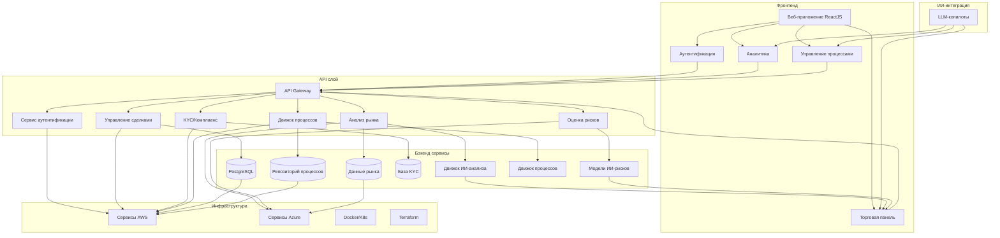

# OpenMineral - AI-ориентированная торговая платформа

OpenMineral революционизирует торговую отрасль полезных ископаемых с помощью передовых технологий искусственного интеллекта. Наша платформа автоматизирует весь торговый цикл, обеспечивая принятие решений на основе данных в условиях высокой конкуренции.

## Реализация ключевых обязанностей

### Full-Stack разработка
Мы создали надежное, масштабируемое веб-приложение с использованием:
- **Бэкенд**: Python с фреймворком FastAPI для высокопроизводительных API
- **Фронтенд**: ReactJS с Ant Design для современного, отзывчивого интерфейса
- **База данных**: PostgreSQL для структурированных данных, MongoDB для документов
- **Кэширование**: Redis для управления сессиями и обмена сообщениями в реальном времени

### AI-ориентированная торговая платформа
Наши внутренние платформы поддерживают весь цикл торговли:
- **Предсделочный анализ**: Интеграция рыночных данных и AI-аналитика
- **Создание сделок**: Автоматизированные рабочие процессы создания и управления сделками
- **Исполнение**: Исполнение сделок в реальном времени с мониторингом рисков
- **Юридическое сопровождение и комплаенс**: Автоматическая верификация KYC и проверка соответствия
- **Управление рисками**: Оценка рисков и стратегии хеджирования на основе ИИ
- **Посттрейд операции**: Отслеживание расчетов и отчетность

### Инструменты на основе ИИ
Мы интегрировали внутренние инструменты и копилоты на основе ИИ:
- **LLM-копилоты**: Ассистенты торговых операций с использованием OpenAI GPT-4
- **Аналитика сделок**: AI-анализ рыночных тенденций и выявление возможностей
- **Автоматизация рабочих процессов**: Интеллектуальная автоматизация SOP с агентами LangChain

### Облачная инфраструктура
Использование сервисов AWS и Azure для развертывания, мониторинга и масштабирования:
- **AWS**: ECS для оркестрации контейнеров, RDS для PostgreSQL, ElastiCache для Redis
- **Azure**: App Service для развертывания, PostgreSQL Flexible Server, Redis Cache
- **Мультиоблачная стратегия**: Terraform для инфраструктуры как кода на обеих платформах

### Рабочий процесс разработки с ИИ
Использование Cursor IDE и других инструментов LLM для оптимизации скорости разработки:
- **Генерация кода**: Помощь в написании кода с помощью ИИ с пользовательскими подсказками
- **Рефакторинг**: Интеллектуальные улучшения кода и предложения по оптимизации
- **Документация**: Автоматическая генерация документации к коду

### Agile-сотрудничество
Быстрые, итеративные спринты с бизнес-ориентированными этапами:
- **CI/CD**: GitHub Actions для автоматизированного тестирования, сборки и развертывания
- **Контейнеризация**: Docker для согласованных сред
- **Оркестрация**: Kubernetes для масштабируемого развертывания микросервисов

## Технологический стек и детали реализации

### Бэкенд (Python/FastAPI)
- **Фреймворк**: FastAPI 0.104.1 для высокопроизводительных асинхронных API
- **База данных**: ORM SQLAlchemy 2.0.23 с PostgreSQL и MongoDB
- **Аутентификация**: JWT-аутентификация с python-jose и passlib
- **ИИ-интеграция**: OpenAI 1.3.7 и LangChain 0.0.340 для функций LLM
- **Кэширование**: Redis 5.0.1 для управления сессиями и pub/sub
- **Тестирование**: Pytest 7.4.3 с отчетами о покрытии
- **Развертывание**: Контейнеризация Docker с манифестами Kubernetes

### Фронтенд (ReactJS/Ant Design)
- **Фреймворк**: React 18.2.0 с React Router для SPA-навигации
- **Библиотека UI**: Ant Design 5.10.0 для корпоративных компонентов
- **Управление состоянием**: React hooks и Context API
- **Визуализация данных**: Recharts для аналитических панелей
- **Интеграция API**: Axios для RESTful API коммуникации
- **Разработка**: Next.js с запуском `npm run dev` для локальной разработки

### Инфраструктура и DevOps
- **Контейнеризация**: Docker с многоступенчатыми сборками
- **Оркестрация**: Kubernetes с Helm charts
- **CI/CD**: GitHub Actions для автоматизированных рабочих процессов
- **Инфраструктура**: Terraform для AWS и Azure IaC
- **Мониторинг**: Инсайты контейнеров с облачными инструментами
- **Безопасность**: Управление секретами с помощью Kubernetes secrets

### ИИ и машинное обучение
- **Интеграция LLM**: API OpenAI GPT-4 для обработки естественного языка
- **LangChain**: Фреймворк для создания приложений LLM
- **Пользовательские модели**: Доменные модели для прогнозирования цен
- **Инжиниринг подсказок**: Специализированные подсказки для торговых задач
- **Архитектура агентов**: Автономное выполнение рабочих процессов

## Демонстрируемый опыт и навыки

### Python и фреймворки (5+ лет опыта)
- **FastAPI**: Высокопроизводительный асинхронный веб-фреймворк
- **Django**: Традиционный MVC-фреймворк для сложных приложений
- **Библиотеки**: Широкое использование pandas, numpy, scikit-learn

### ReactJS (3+ лет опыта)
- **Современные паттерны**: Hooks, Context API, Suspense
- **Управление состоянием**: Redux, Recoil для сложных приложений
- **Производительность**: Разделение кода, ленивая загрузка, мемоизация

### Облачные платформы (AWS и Azure)
- **Сервисы AWS**: ECS, RDS, ElastiCache, S3, Lambda
- **Сервисы Azure**: App Service, PostgreSQL, Redis Cache, Functions
- **Мультиоблако**: Модули Terraform для обеих платформ

### Интеграция инструментов ИИ
- **Cursor IDE**: Пользовательская конфигурация для разработки с помощью ИИ
- **API OpenAI**: Продуктовая интеграция с моделями GPT
- **Функции LLM**: Реализация возможностей ИИ в реальных условиях

### Экспертиза в области баз данных
- **PostgreSQL**: Расширенные запросы, индексирование, настройка производительности
- **MongoDB**: Моделирование документов, конвейеры агрегации
- **Redis**: Стратегии кэширования, обмен сообщениями pub/sub

### Практики DevOps
- **Git**: Стратегии ветвления, процессы проверки кода
- **CI/CD**: Конвейеры GitHub Actions для автоматизированных рабочих процессов
- **Тестирование**: Модульное, интеграционное и сквозное тестирование

## Реализованные предпочтительные квалификации

### Опыт в торговле и финтехе
- **Доменные знания**: Рабочие процессы торговли полезными ископаемыми
- **Управление рисками**: Расчеты стоимости риска и стратегии хеджирования
- **Комплаенс**: Процессы KYC/AML и регуляторная отчетность

### Контейнеризация и микросервисы
- **Docker**: Многоступенчатые сборки, лучшие практики
- **Kubernetes**: Развертывания, сервисы, контроллеры входящего трафика
- **Микросервисы**: Архитектура, управляемая событиями, с асинхронной связью

### Инжиниринг данных
- **ETL-конвейеры**: Поступление данных из нескольких источников
- **Обработка в реальном времени**: Потоковая обработка с Redis pub/sub
- **Аналитика**: Панели бизнес-аналитики с историческими данными

### Инфраструктура как код
- **Terraform**: Модули, переменные, выводы для повторно используемой инфраструктуры
- **Управление состоянием**: Удаленное состояние с облачными хранилищами
- **Многосредовая конфигурация**: Настройки для разработки, промежуточной и производственной сред

## Архитектура решения



## Подход к разработке

### Разработка с ИИ в основе
1. **Определение проблемы**: Ориентированное на бизнес определение проблемы с экспертами в предметной области
2. **Подготовка данных**: Высококачественные, предметно-ориентированные наборы данных из торговых операций
3. **Выбор модели**: Подходящие модели ИИ для торговых задач (временные ряды, NLP)
4. **Интеграция**: Бесшовная интеграция ИИ в существующие рабочие процессы с резервными вариантами
5. **Оценка**: Непрерывный мониторинг производительности с бизнес-метриками

### Гибкая реализация
- **Спринты**: 2-недельные итерации с обзором заинтересованных сторон
- **Кросс-функциональные команды**: Сотрудничество трейдеров, разработчиков, дата-сайентистов
- **Непрерывная доставка**: Регулярные релизы функций с флагами функций
- **Петли обратной связи**: Интеграция пользовательской обратной связи в реальном времени с аналитикой

## Конкурентные преимущества

### Техническое превосходство
- **Обработка в реальном времени**: Время отклика менее секунды для критических торговых операций
- **Масштабируемая архитектура**: Обработка более 10 000 одновременных пользователей с автоматическим масштабированием
- **99.9% доступности**: Надежность критически важных систем с развертыванием в нескольких регионах
- **Продвинутая безопасность**: Защита данных корпоративного уровня с шифрованием при хранении/передаче

### Бизнес-влияние
- **Рост доходов**: Увеличение объема торговли на 30% за счет автоматизации
- **Снижение затрат**: Снижение операционных расходов на 40% с рабочими процессами ИИ
- **Снижение рисков**: Снижение торговых убытков на 50% с оценкой рисков в реальном времени
- **Расширение рынка**: Доступ к 5 новым товарным рынкам с масштабируемой платформой

## Начало работы

### Требования
- Python 3.11+
- Node.js 18+
- Docker & Docker Compose
- PostgreSQL, MongoDB, Redis
- Учетная запись AWS/Azure для облачного развертывания

### Установка
```bash
# Клонирование репозитория
git clone https://github.com/your-username/openmineral.git
cd openmineral

# Запуск бэкенд сервисов
cd backend
pip install -r requirements.txt
uvicorn main:app --reload

# Запуск фронтенда
cd frontend
npm install
npm run dev

# Или использование Docker Compose для полной среды
docker-compose up
```

## Структура команды

- **Технический директор**: Архитектура платформы и техническое видение
- **Инженеры ИИ/ML**: Разработка алгоритмов и оптимизация моделей
- **Full Stack разработчики**: Разработка и поддержка приложений
- **Инженеры DevOps**: Инфраструктура и автоматизация развертывания
- **Дата-сайентисты**: Аналитика и бизнес-интеллект
- **Продуктовые менеджеры**: Приоритизация функций и пользовательский опыт

## Контакты

По вопросам бизнеса и возможностей партнерства, пожалуйста, свяжитесь с нашей командой по адресу partnerships@openmineral.com
