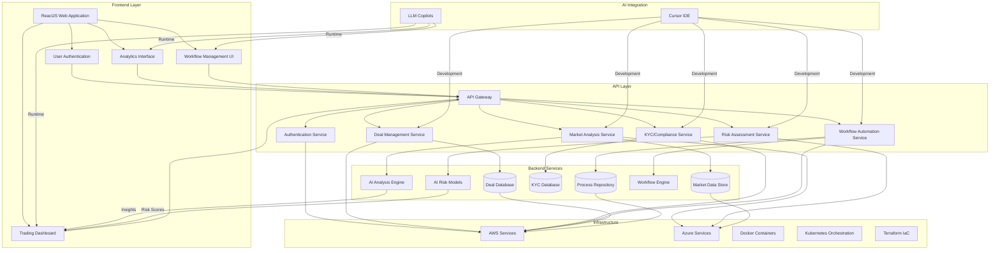

# OpenMineral Technical Vision and Architecture

## Technical Vision

OpenMineral's technical vision is to create a cutting-edge, AI-powered trading platform that transforms the mineral commodities trading industry. Our platform will:

1. **Automate Standard Operating Procedures** - Reduce manual work through intelligent workflows that guide users through complex trading processes
2. **Enhance Decision Making** - Provide AI-driven insights for market analysis, risk assessment, and deal evaluation
3. **Ensure Scalability and Reliability** - Build a cloud-native architecture that can handle high volumes of trades and data
4. **Maintain Security and Compliance** - Implement robust security measures and compliance checks throughout the platform
5. **Enable Rapid Development** - Leverage AI-assisted development tools to accelerate feature delivery and improve code quality

## Architecture Overview

### High-Level Architecture

## AI Tools and Approaches

### Development with Cursor IDE

Our development approach centers around Cursor IDE, which provides AI-assisted coding capabilities:

- **Code Generation** - Automatically generate boilerplate code, API endpoints, and UI components
- **Refactoring Suggestions** - AI-powered refactoring recommendations to improve code quality
- **Documentation Creation** - Automatic generation of code documentation and comments
- **Bug Detection** - Early identification of potential bugs and security issues

### LLM-Based Copilots

We implement specialized AI copilots for different aspects of trading operations:

- **Deal Intelligence Assistant** - Analyzes deal structures, identifies potential risks, and suggests optimization strategies
- **Compliance Copilot** - Ensures all deals meet regulatory requirements and flags potential compliance issues
- **Market Analysis Agent** - Provides real-time insights on market conditions and price forecasts
- **Workflow Automation Bot** - Guides users through SOPs and automates repetitive tasks

### AI-First Development Methodology

Our development process follows an AI-first approach:

1. **Problem Definition** - Clearly articulate business problems that can be solved with AI
2. **Data Preparation** - Ensure high-quality, well-structured data for AI models
3. **Model Selection** - Choose appropriate AI models for specific use cases
4. **Integration** - Seamlessly integrate AI capabilities into existing workflows
5. **Evaluation** - Continuously measure AI performance and business impact

## Cloud Infrastructure (AWS/Azure)

### AWS Services

- **EC2** - Compute resources for application services
- **RDS** - Managed PostgreSQL database instances
- **S3** - Storage for documents and unstructured data
- **Lambda** - Serverless functions for specific processing tasks
- **API Gateway** - RESTful API management and routing
- **EKS** - Kubernetes service for container orchestration
- **CloudWatch** - Monitoring and logging services

### Azure Services

- **Azure VMs** - Virtual machines for compute-intensive tasks
- **Azure SQL Database** - Alternative database solution
- **Blob Storage** - Object storage for large files and backups
- **Azure Functions** - Serverless computing platform
- **Azure Kubernetes Service (AKS)** - Managed Kubernetes for container orchestration
- **Azure Monitor** - Comprehensive monitoring solution
- **Cognitive Services** - AI services for natural language processing and analysis

### Infrastructure as Code with Terraform

We use Terraform to manage our cloud infrastructure:

- **Modular Design** - Reusable modules for different service components
- **Environment Separation** - Distinct configurations for development, staging, and production
- **Version Control** - Infrastructure changes tracked in Git repositories
- **Automated Provisioning** - One-click deployment of entire platform infrastructure

## Microservices Architecture

Our backend follows a microservices pattern for maximum flexibility:

- **Deal Management Service** - Handles creation, modification, and tracking of trading deals
- **Market Data Service** - Integrates with external data sources and provides market insights
- **KYC/Compliance Service** - Manages user verification and regulatory compliance
- **Risk Assessment Service** - Evaluates and scores deal risks using AI models
- **Workflow Service** - Orchestrates business processes and SOP automation
- **Notification Service** - Sends alerts and updates to users

## Data Management Strategy

- **Structured Data** - PostgreSQL for relational data like deals, users, and transactions
- **Unstructured Data** - MongoDB for documents, reports, and market analysis data
- **Caching Layer** - Redis for frequently accessed data and session management
- **Data Pipelines** - Automated ETL processes for data integration and cleaning
- **Analytics Engine** - Specialized services for business intelligence and reporting

## Security and Compliance

- **Authentication** - OAuth 2.0 and JWT-based secure authentication
- **Authorization** - Role-based access control (RBAC) for different user types
- **Data Encryption** - At-rest and in-transit encryption for sensitive information
- **Audit Trails** - Comprehensive logging of all user actions and system events
- **Compliance Monitoring** - Automated checks for regulatory compliance requirements