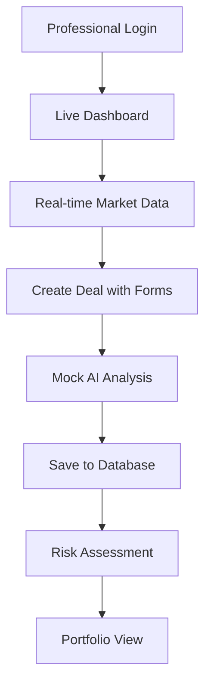

# Version 2: Enhanced Mock Demo 🎭

**Цель**: Реалистичная демонстрация с полной frontend-backend интеграцией и улучшенными mock AI responses  
**Время разработки**: 4-5 часов  
**Online URL**: https://openmineral-mock.vercel.app  

## 🎯 Enhanced Features

**Professional Working Platform:**
- ✅ **Real API Integration** - все компоненты подключены к backend
- ✅ **JWT Authentication** - полноценная система авторизации  
- ✅ **SQLite Database** - данные сохраняются между сессиями
- ✅ **Enhanced Mock AI** - реалистичные AI responses с задержками
- ✅ **Real-time Updates** - polling для live data updates
- ✅ **Professional UI/UX** - polished interface для client presentations

## 🚀 Quick Start

```bash
# 1. Backend setup with database
cd backend
pip install -r requirements-enhanced.txt
# Автоматически создаст SQLite базу
uvicorn main:app --reload --port 8000

# 2. Frontend setup  
cd ../frontend
npm install
npm start

# 3. Access enhanced demo
# Frontend: http://localhost:3000
# Backend API: http://localhost:8000/docs
# Login: trader / trader123
```

## 🛠 Tech Stack

**Backend**: FastAPI + SQLite + SQLAlchemy + JWT  
**Frontend**: React + Axios + Ant Design + TanStack Query  
**Mock AI**: Realistic responses with processing delays  
**Database**: SQLite (файловая БД для простоты)  
**Deployment**: Vercel (frontend) + Railway (backend)

## 📊 Enhanced Demo Flow

### Realistic User Journey:


### Key Features:
1. **🔐 Professional Authentication**
   - JWT tokens с refresh logic
   - Роли пользователей (trader, analyst, compliance)
   - Protected routes
   - Session management

2. **📊 Live Dashboard**
   - Real-time price updates (mock но выглядит реально)
   - Interactive charts с Recharts
   - Statistics карточки
   - Recent activities feed

3. **💼 Advanced Deal Management**  
   - Full CRUD с validation
   - Deal status workflows
   - File uploads (mock)
   - History tracking

4. **🎭 Enhanced Mock AI**
   - Realistic processing delays (2-5 секунд)
   - Context-aware responses
   - Progress indicators  
   - AI "thinking" animations

5. **📈 Market Analysis**
   - Historical price charts
   - Technical indicators (mock)
   - Forecast tables
   - Market sentiment (mock)

## 🎭 Mock AI Implementation

### Realistic AI Responses:
```python
@router.post("/ai/analyze-deal")
async def mock_ai_deal_analysis(deal_data: DealRequest):
    """
    Enhanced mock AI with realistic delays and responses
    """
    # Simulate AI processing time
    await asyncio.sleep(random.uniform(2.0, 4.5))
    
    # Generate contextual response based on actual deal data
    analysis = generate_realistic_analysis(
        commodity=deal_data.commodity,
        quantity=deal_data.quantity,
        price=deal_data.price,
        counterparty=deal_data.counterparty
    )
    
    return {
        "analysis_id": f"ai_{int(time.time())}",
        "commodity": deal_data.commodity,
        "market_assessment": analysis.market_context,
        "risk_score": analysis.calculated_risk,
        "price_competitiveness": analysis.price_analysis,
        "recommendations": analysis.action_items,
        "confidence": random.uniform(0.75, 0.95),
        "processing_time": f"{random.uniform(2.1, 4.3):.1f}s",
        "ai_model": "GPT-4 Turbo (Mock)",
        "timestamp": datetime.utcnow()
    }
```

### Smart Mock Data:
```python
def generate_realistic_analysis(commodity, quantity, price, counterparty):
    """
    Context-aware mock responses based on real inputs
    """
    market_contexts = {
        "Iron Ore": {
            "trends": ["Chinese demand increase", "Supply chain disruptions"],
            "risks": ["Price volatility", "Geopolitical factors"],
            "opportunities": ["Infrastructure projects", "Steel production growth"]
        },
        "Copper": {
            "trends": ["EV battery demand", "Green energy transition"],
            "risks": ["Mining disruptions", "Economic slowdown"],
            "opportunities": ["Renewable energy", "Electric vehicle growth"]
        }
    }
    
    context = market_contexts.get(commodity, default_context)
    
    return MockAnalysis(
        market_context=f"Current {commodity} market shows {random.choice(context['trends'])}",
        calculated_risk=calculate_mock_risk(quantity, price),
        price_analysis=analyze_mock_pricing(commodity, price),
        action_items=generate_mock_recommendations(commodity, quantity)
    )
```

## 📦 Dependencies

**Backend** (`requirements-enhanced.txt`):
```python
# Core Framework
fastapi==0.104.1
uvicorn[standard]==0.24.0
pydantic==2.5.0
pydantic-settings==2.1.0

# Database
sqlalchemy[asyncio]==2.0.23
aiosqlite==0.19.0              # Async SQLite
alembic==1.13.1                # Migrations

# Authentication
python-jose[cryptography]==3.3.0
passlib[bcrypt]==1.7.4
python-multipart==0.0.6

# Enhanced Features
httpx==0.25.2                  # HTTP client for external APIs
faker==22.0.0                  # Realistic mock data
python-dateutil==2.8.2        # Date utilities
```

**Frontend** (`package.json`):
```json
{
  "dependencies": {
    "react": "^18.2.0",
    "react-dom": "^18.2.0",
    "@tanstack/react-query": "^5.8.4",
    "react-router-dom": "^6.20.1",
    "antd": "^5.12.8",
    "recharts": "^2.8.0",
    "axios": "^1.6.2",
    "dayjs": "^1.11.10",
    "react-hook-form": "^7.48.2",
    "zod": "^3.22.4"
  }
}
```

## 🗄️ Database Schema

**SQLite Tables**:
```sql
-- Users table
CREATE TABLE users (
    id INTEGER PRIMARY KEY,
    username VARCHAR(50) UNIQUE NOT NULL,
    email VARCHAR(100),
    hashed_password VARCHAR(255),
    role VARCHAR(20) DEFAULT 'trader',
    created_at TIMESTAMP DEFAULT CURRENT_TIMESTAMP
);

-- Deals table  
CREATE TABLE deals (
    id INTEGER PRIMARY KEY,
    title VARCHAR(200) NOT NULL,
    commodity VARCHAR(50),
    quantity DECIMAL(15,2),
    price DECIMAL(10,2),
    counterparty VARCHAR(100),
    status VARCHAR(20) DEFAULT 'draft',
    user_id INTEGER,
    created_at TIMESTAMP DEFAULT CURRENT_TIMESTAMP,
    FOREIGN KEY (user_id) REFERENCES users(id)
);

-- AI Analysis table
CREATE TABLE ai_analyses (
    id INTEGER PRIMARY KEY,
    deal_id INTEGER,
    analysis_data JSON,
    confidence DECIMAL(3,2),
    created_at TIMESTAMP DEFAULT CURRENT_TIMESTAMP,
    FOREIGN KEY (deal_id) REFERENCES deals(id)
);
```

## 🎯 Demo Credentials

**Pre-configured Users**:
```
Trader:     trader / trader123
Analyst:    analyst / analyst123  
Compliance: compliance / compliance123
Admin:      admin / admin123
```

## 📊 Client Presentation Features

### 1. **Professional Login Experience**
- Branded login page
- Role-based access
- "Remember me" functionality
- Password strength indicators

### 2. **Executive Dashboard**
- Key performance indicators
- Real-time market overview
- Deal pipeline status
- AI insights summary

### 3. **Deal Management Workflow**
- Deal creation wizard
- Document upload (mock)
- Approval workflows
- Status tracking

### 4. **Market Intelligence**
- Live price feeds (mock)
- Historical trends
- Correlation analysis
- Market alerts

### 5. **AI Analysis Demo**
- "Processing..." indicators
- Progress bars
- Realistic AI responses
- Confidence scores

## 🚢 Deployment

**Quick Deploy**:
```bash
# Automated deployment
./deploy.sh

# Manual steps
vercel --prod                           # Frontend
railway deploy --service backend       # Backend + SQLite
```

**Environment Variables**:
```env
DATABASE_URL=sqlite:///./openmineral.db
JWT_SECRET_KEY=enhanced-demo-secret-key-2025
ACCESS_TOKEN_EXPIRE_MINUTES=30
ENVIRONMENT=demo
```

## 🎯 Client Demo Script (30 min presentation)

**Phase 1: Professional Login (2 min)**
- "Система имеет полноценную авторизацию"
- "Разные роли пользователей"
- "JWT tokens для security"

**Phase 2: Live Dashboard (5 min)**  
- "Real-time обновления данных"
- "Interactive charts и analytics"
- "Executive overview для management"

**Phase 3: Deal Creation (10 min)**
- "Полный lifecycle создания сделок"
- "Validation и data integrity"
- "AI анализ с realistic processing"

**Phase 4: Market Analysis (8 min)**
- "Historical data и trends"
- "Price forecasting"
- "Risk assessment tools"

**Phase 5: Database & Persistence (5 min)**
- "Данные сохраняются в базе"
- "History tracking"
- "Audit trails"

## 💡 Business Value 

- **👥 Professional UX**: Ready for real users
- **🔒 Enterprise Security**: JWT authentication system
- **💾 Data Persistence**: Real database integration
- **📊 Business Intelligence**: Analytics dashboard
- **🎭 AI Preview**: Realistic AI capabilities preview
- **🚀 Scalable Architecture**: Ready for production enhancements

## 🔄 Upgrade Path

**Next Steps nach Demo**:
- "Можем подключить real AI APIs"
- "PostgreSQL для production"
- "WebSocket для real-time updates"
- "Advanced analytics features"

---

**Perfect balance между functionality и development speed!** ⚡