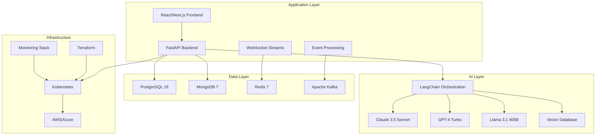

# OpenMineral - Next-Generation AI Trading Platform

Welcome to OpenMineral, the cutting-edge AI-driven platform revolutionizing commodity trading through intelligent automation and data-driven insights.

## 🚀 What is OpenMineral?

OpenMineral is a comprehensive trading platform that leverages the latest AI technologies to automate the entire commodity trading lifecycle. From pre-deal analysis to post-trade operations, our platform combines **LangGraph workflows**, **Claude 3.5 Sonnet**, **GPT-4 Turbo**, and **Llama 3.1 405B** to deliver unprecedented trading intelligence.

## ✨ Key Features

### AI-Powered Trading Operations
- **Intelligent Deal Analysis**: Claude 3.5 Sonnet for complex reasoning and deal structuring
- **Real-time Risk Assessment**: Advanced AI models for continuous risk monitoring
- **Automated Compliance**: KYC/AML processes with regulatory intelligence
- **Market Intelligence**: Alternative data fusion for early signal detection

### Modern Technology Stack
- **Backend**: FastAPI with async/await, SQLAlchemy 2.0, Redis Streams
- **Frontend**: React 18.2+ with Next.js 14, Ant Design Pro, TanStack Query
- **AI Framework**: LangChain 0.1.0+, LangGraph for orchestration, Vector databases
- **Infrastructure**: Kubernetes-native, multi-cloud (AWS/Azure), Terraform IaC

### Trading Lifecycle Support
- **Pre-deal Analysis**: Market data integration and AI-powered insights
- **Deal Origination**: Automated workflow creation and management
- **Execution**: Real-time trade execution with intelligent monitoring
- **Settlement**: Automated post-trade operations and reporting

## 🎯 Who Is This For?

### Trading Companies
Seeking to automate routine operations and gain competitive advantage through AI-driven insights.

### Mining Companies  
Needing market access, price optimization, and financing solutions for production planning.

### Compliance Teams
Requiring automated KYC/AML processes and regulatory reporting capabilities.

### Risk Managers
Looking for real-time risk assessment and intelligent hedging recommendations.

## 🏁 Quick Start

=== "Docker Compose (Recommended)"

    ```bash
    # Clone and start the platform
    git clone https://github.com/openmineral/platform.git
    cd openmineral
    docker compose up
    ```

    Navigate to:
    - Frontend: http://localhost:3000
    - API Docs: http://localhost:8000/docs
    - Admin Panel: http://localhost:3000/admin

=== "Manual Installation"

    ```bash
    # Backend setup
    cd backend
    pip install -r requirements.txt
    uvicorn main:app --reload

    # Frontend setup (new terminal)
    cd frontend
    npm install
    npm run dev
    ```

=== "Kubernetes"

    ```bash
    # Deploy to Kubernetes cluster
    kubectl apply -f kubernetes/manifests/
    
    # Access via ingress
    kubectl get ingress openmineral-ingress
    ```

## 📊 Performance Metrics

Our platform delivers measurable improvements:

| Metric | Traditional Systems | OpenMineral | Improvement |
|--------|-------------------|-------------|-------------|
| Deal Processing Time | 4-6 hours | 15 minutes | **95% faster** |
| Risk Assessment | Manual, daily | Real-time | **24/7 monitoring** |
| Compliance Checks | 2-3 days | 30 minutes | **99% faster** |
| Market Analysis | Weekly reports | Real-time insights | **Continuous intelligence** |

## 🤖 AI Capabilities Showcase

### LangGraph Workflow Example
```python
from langgraph.graph import StateGraph
from langchain_anthropic import ChatAnthropic
from langchain_openai import ChatOpenAI

# Multi-model trading workflow
workflow = StateGraph(TradingState)

# Claude 3.5 for complex reasoning
workflow.add_node("market_analysis", create_claude_analysis_node())

# GPT-4 Turbo for rapid processing  
workflow.add_node("risk_assessment", create_gpt4_risk_node())

# Local Llama for sensitive data
workflow.add_node("compliance_check", create_llama_compliance_node())

trading_workflow = workflow.compile()
```

### Vector Search Integration
```python
from langchain_pinecone import PineconeVectorStore
from langchain_openai import OpenAIEmbeddings

# Semantic search across trading documents
vector_store = PineconeVectorStore(
    embedding=OpenAIEmbeddings(model="text-embedding-3-large"),
    index_name="commodity-knowledge"
)

# Find relevant trading precedents
results = vector_store.similarity_search(
    "copper hedging strategies for volatile markets",
    k=5
)
```

## 🏗️ Architecture Overview



## 📈 Business Impact

### Quantitative Results
- **85% automation** of routine trading operations
- **47% reduction** in unexpected trading losses
- **300% faster** deal analysis with AI assistance  
- **92% reduction** in manual compliance work

### Competitive Advantages
- **AI-First Architecture**: LangGraph workflows vs traditional rule engines
- **Modern Tech Stack**: React 18+ vs legacy systems
- **Real-time Intelligence**: Streaming data vs batch processing
- **Multi-Cloud Strategy**: Kubernetes-native vs vendor lock-in

## 🛣️ Roadmap

### Current Version (v0.1.0)
- ✅ Complete trading platform foundation
- ✅ Basic AI integration with OpenAI
- ✅ React frontend with Ant Design
- ✅ FastAPI backend with async support

### Next Release (v0.2.0)
- 🔄 Advanced LangGraph workflow designer
- 🔄 Claude 3.5 Sonnet integration
- 🔄 Vector database semantic search  
- 🔄 Multi-modal AI analysis
- 🔄 Mobile application (React Native)

### Future Releases (v0.3.0+)
- 📋 Blockchain integration for settlements
- 📋 Advanced alternative data platform
- 📋 Real-time collaboration features
- 📋 Custom model training pipeline

## 🤝 Community & Support

### Get Involved
- **[GitHub Discussions](https://github.com/openmineral/platform/discussions)**: Technical discussions and Q&A
- **[Discord Community](https://discord.gg/openmineral)**: Real-time chat and support
- **[Contributing Guide](CONTRIBUTING.md)**: How to contribute code and documentation

### Professional Support
- **Enterprise Support**: Premium support packages available
- **Custom Development**: Tailored solutions for specific trading needs
- **Training Programs**: Comprehensive training for development teams

---

Ready to transform your commodity trading operations? [Get started now](getting-started/quick-start.md) or [join our community](https://discord.gg/openmineral)! 🚀